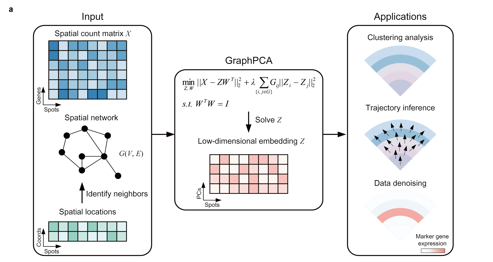

# GraphPCA

GraphPCA is a novel graph-constrained, interpretable, and quasi-linear dimension-reduction method tailored for spatial transcriptomic data. It leverages the strengths of graphical regularization and Principal Component Analysis (PCA) to extract low-dimensional embeddings of spatial transcriptomes that integrate location information in linear time complexity. The substantial power boost enabled by GraphPCA fertilizes various downstream tasks of spatial transcriptomics data analyses and provides more precise insights into transcriptomic and cellular landscapes of complex tissues.  

---

## 🚀 Performance Update (v0.2.1)

We have significantly refactored the computational core of GraphPCA to handle million-level datasets with ease.

* **⚡️ C++ Backend Acceleration**: Iterative processes are now powered by a high-performance C++ engine (`Eigen3` / `pybind11`), achieving an unprecedented **5x to 20x speedup**.
* **🧠 PCG Optimization**: Introduced the Preconditioned Conjugate Gradient (PCG) method to minimize memory footprint and computational overhead for ultra-large-scale analysis.
* **🛡️ Hybrid Mode & Graceful Degradation**: Seamlessly switch between `accelerated` (C++ backend) and `standard` (pure Python) modes. The installation process automatically falls back to the pure Python version if C++ dependencies are missing, ensuring 100% out-of-the-box usability.

---

## 📖 Tutorials

Interactive tutorials and documentation can be found here: 
[https://graphpca-analyses.readthedocs.io/en/latest/index.html](https://graphpca-analyses.readthedocs.io/en/latest/index.html)

> **Note for v0.2.1**: To improve memory efficiency, `Run_GPCA` now returns `Z, W` by default. If you need to follow older tutorials that unpack `Z, W, ZW_log`, please set `return_log=True` when calling the function.

---

## 📦 Installation

### Standard Installation (Pure Python)
Install the standard version of GraphPCA via PyPI:
```bash
pip install st-graphpca
```

### Accelerated Installation (C++ Backend)
To enable C++ acceleration, please ensure the `Eigen3` library is installed on your system **before** installing GraphPCA. We highly recommend using Conda:
```bash
conda install -c conda-forge eigen
pip install --no-build-isolation st-graphpca
```

---

## 🛠️ Software Dependencies

GraphPCA relies on the following industry-standard libraries:
- `numpy`, `pandas`, `scipy`
- `matplotlib`, `scikit-learn`
- `networkx`, `scanpy`, `squidpy`
- `pybind11` (for C++ acceleration)

---

## 📅 Recent Changes

- **v0.2.1**: Resolved PEP 517 build isolation issues; enhanced graceful fallback for C++ modules to improve installation success rates.
- **v0.2.0**: Major performance release featuring the C++ backend, PCG iterative solver, and memory footprint optimization.
